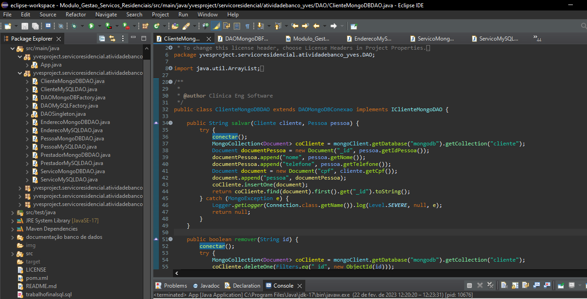
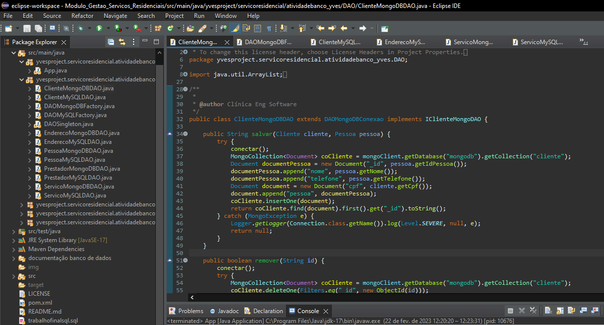
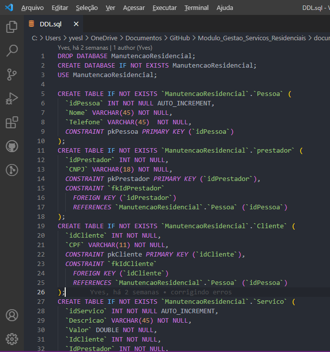
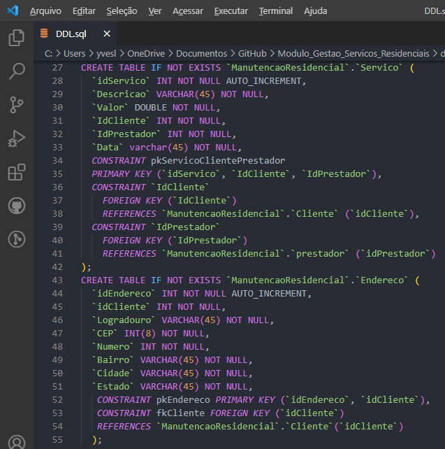

<h1 align="center"> Módulo de gestão de serviços residenciais </h1>

  

 Projeto desenvolvido com Java, MySQL e MongoDB.
 

  <a href="#-sobre-o-projeto">Sobre o projeto</a>&nbsp;&nbsp;&nbsp;|&nbsp;&nbsp;&nbsp; 
  <a href="#-layouts">Layouts</a>&nbsp;&nbsp;&nbsp;|&nbsp;&nbsp;&nbsp;
  <a href="#-requisitos-e-recomendações">Requisitos e recomendações</a>&nbsp;&nbsp;&nbsp;&nbsp;&nbsp;&nbsp;

</img>

# 💻 Sobre o projeto 

Módulo responsável por realizar a conexão com o(s) banco de dados por meio de uma DAO e abstract factory para realizar serviços de inclusão, exclusão visualização e atualização de dados relacionados à um sistema de controle de serviços residenciais. O trabalho foi proposto na matéria "banco de dados" e seu objetivo era aplicar na prática os conceitos de banco de dados relacionais e, como extra, adaptar o DDL criado para funcionar em um banco de dados não relacional. 

# 📸 Layouts 

<h3 align="center">Exemplo de inserção em MySQL</h3>

</img>

 
<h3 align="center">Exemplo de inserção em MongoDB</h3>

</img>
 
 
<h3 align="center">DML do banco de dados relacional</h3>

</img>
 

</img>
 
 
  

# 📝 Requisitos e recomendações

REQUISITOS:
- Java 17
- MySQL WorkBanch 8.0 instalado
- MongoDB Server 4.0 Instalado

PASSOS ANTES DE EXECUTAR O PROJETO:  
1- Configure o banco de dados mysql e mongodb no .env  
2- Execute o script DDL e DML (caso queira popular o banco) para criar o banco necessário.  
3- Realize o update project no maven do projeto.  
4- Insira linhas de consulta/modificação no App.java do projeto de acordo com os exemplos de lá.

# ✒️ Autor

Yves Lima Silva

<a href="https://www.linkedin.com/in/yves-lima-b63b2515b/"> Linkedin </a>
